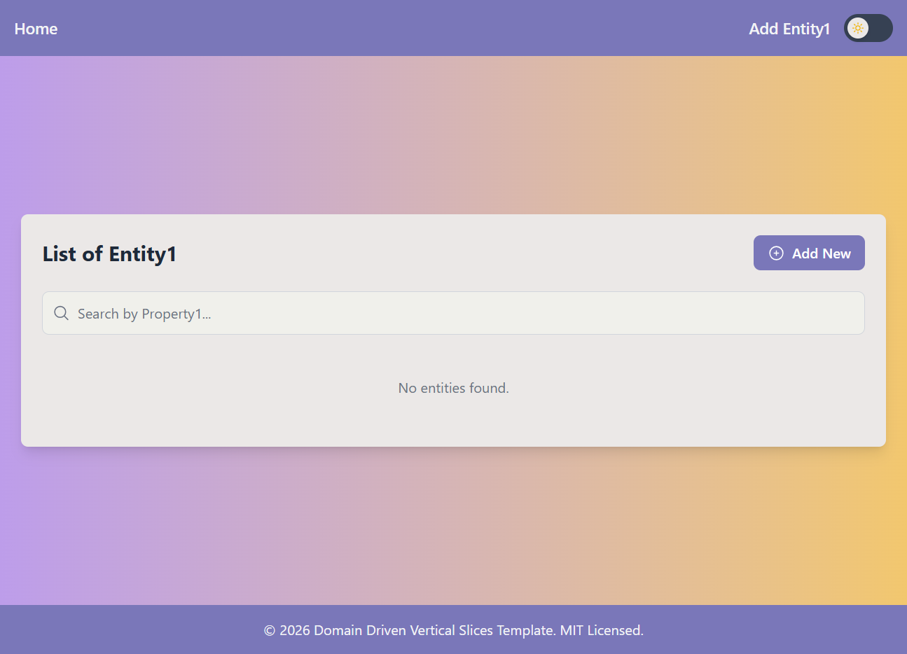
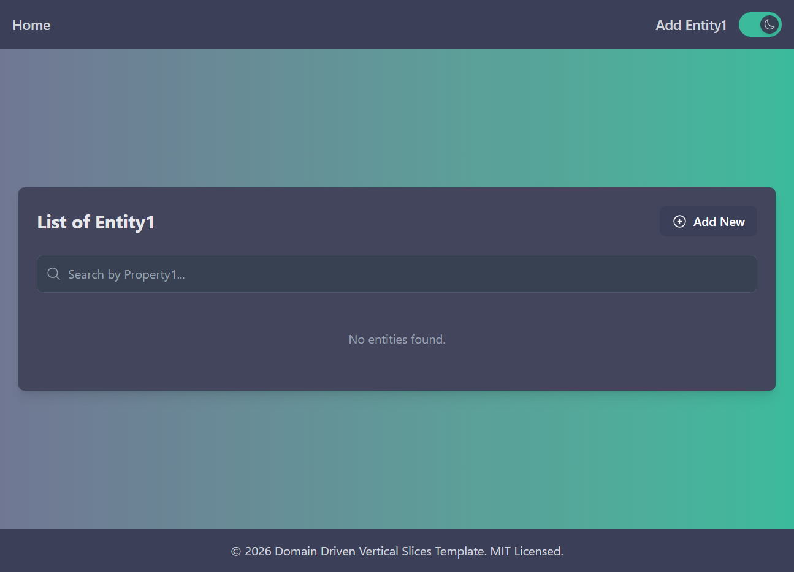

# Domain Driven Vertical Slices Template

[](https://github.com/RezaMashayekhi/DomainDrivenVerticalSlices.Template/actions/workflows/build.yml)
[](https://github.com/RezaMashayekhi/DomainDrivenVerticalSlices.Template/actions/workflows/codeql.yml)
[](https://www.nuget.org/packages/RM.DomainDrivenVerticalSlices.Template)
[](https://www.nuget.org/packages/RM.DomainDrivenVerticalSlices.Template)

An ASP.NET Core template implementing **Domain-Driven Design (DDD)** with **Vertical Slice Architecture**. Built for scalability, maintainability, and clean separation of concerns — with optional React UI, .NET Aspire orchestration, and comprehensive testing infrastructure.

## Like This Template? ⭐

If you find this template helpful, please give it a star on GitHub!

---

## What's New in 10.3.0

### .NET Aspire Integration

- **Aspire AppHost**: Orchestrate your entire application with a single command using .NET Aspire 13.1
- **Service Defaults**: Pre-configured OpenTelemetry, health checks, service discovery, and resilience patterns
- **React + Vite Support**: Automatic Vite dev server integration via `AddViteApp()` when using React UI
- **Dynamic Service Discovery**: Aspire injects service URLs automatically — no hardcoded ports needed

### Domain & Infrastructure Enhancements

- **BaseEntity & BaseAuditableEntity**: Rich base classes with domain event support and automatic audit tracking (Created/Modified timestamps and user info)
- **EF Core Interceptors**: Auto-dispatch domain events and populate audit fields via `SaveChangesAsync` interceptors
- **IUser/CurrentUser**: Clean abstraction for accessing current user context across layers

### Application Layer Improvements

- **Performance Behavior**: Logs warnings for slow-running requests (configurable threshold)
- **Unhandled Exception Behavior**: Centralized exception logging in the mediator pipeline

### Web API Modernization

- **Minimal API Endpoints**: `Entity1Endpoints` as a modern alternative to controllers with `EndpointGroupBase` infrastructure
- **Flexible Routing**: Choose between traditional controllers or minimal API endpoints

### Testing Infrastructure

- **Testcontainers Support**: `TestcontainersWebApplicationFactory` for integration tests against real SQLite databases in Docker
- **MSW Integration**: Mock Service Worker for realistic API mocking in React tests

### UI Improvements

- **Modern React UI**: Tailwind CSS v4, Headless UI, and Heroicons for a polished, accessible interface
- **Dark Mode Support**: Toggle between light and dark themes with localStorage persistence
- **Enhanced UX**: Modal confirmations for delete, cancel, and save operations

### Screenshots

> **Note**: Screenshots are best viewed on [GitHub](https://github.com/RezaMashayekhi/DomainDrivenVerticalSlices.Template). If viewing on NuGet.org, please visit the repository for the full visual experience.

|                   Light Mode                   |                  Dark Mode                   |
| :--------------------------------------------: | :------------------------------------------: |
|  |  |

## Getting Started

### Prerequisites

- [.NET 10.0 SDK](https://dotnet.microsoft.com/download/dotnet/10.0) (10.0.102 or later)
- [Node.js 20.19+ or 22.12+](https://nodejs.org/) (required only for React UI)
- [Docker](https://www.docker.com/) (optional, for Testcontainers integration tests)

### Installation

Install the template from NuGet:

```bash
dotnet new install RM.DomainDrivenVerticalSlices.Template::10.3.0
```

### Create a New Project

**WebAPI Only:**

```bash
dotnet new ddvs -n YourProjectName --UiType None
```

**WebAPI with React UI:**

```bash
dotnet new ddvs -n YourProjectName --UiType React
```

## Running the Application

### Option 1: Using .NET Aspire (Recommended)

The template includes a pre-configured Aspire AppHost for orchestrating all services:

```bash
cd src/YourProjectName.AppHost
dotnet run
```

This starts the Aspire dashboard where you can monitor and access:

- **WebAPI**: Your backend API with health checks and OpenTelemetry
- **React UI** (if included): Vite dev server automatically integrated

### Option 2: Running Services Individually

**Start the WebAPI:**

```bash
cd src/YourProjectName.WebApi
dotnet run
```

**Start the React UI (if included):**

```bash
cd src/YourProjectName.UI.React
npm install
npm run dev
```

## Template Structure

```
YourProjectName/
├── src/
│   ├── YourProjectName.AppHost/          # .NET Aspire orchestration host
│   ├── YourProjectName.ServiceDefaults/  # Shared Aspire service configuration
│   ├── YourProjectName.WebApi/           # ASP.NET Core Web API
│   ├── YourProjectName.Application/      # Business logic, commands, queries
│   ├── YourProjectName.Domain/           # Entities, value objects, domain events
│   ├── YourProjectName.Infrastructure/   # Data access, repositories, EF Core
│   ├── YourProjectName.Common/           # Shared utilities, Result pattern, Mediator
│   └── YourProjectName.UI.React/         # React frontend (if included)
└── test/
    ├── YourProjectName.IntegrationTests/ # Integration tests with Testcontainers
    ├── YourProjectName.Application.Tests/
    ├── YourProjectName.Domain.Tests/
    ├── YourProjectName.Infrastructure.Tests/
    ├── YourProjectName.WebApi.Tests/
    └── YourProjectName.Common.Tests/
```

### Project Descriptions

| Project             | Description                                                                            |
| ------------------- | -------------------------------------------------------------------------------------- |
| **AppHost**         | .NET Aspire orchestration — starts and monitors all services from a single entry point |
| **ServiceDefaults** | OpenTelemetry, health checks, service discovery, and HTTP resilience configuration     |
| **WebApi**          | REST API with controllers and/or minimal API endpoints                                 |
| **Application**     | Commands, queries, DTOs, validators, and pipeline behaviors                            |
| **Domain**          | Entities (with `BaseEntity`/`BaseAuditableEntity`), value objects, and domain events   |
| **Infrastructure**  | EF Core `DbContext`, repositories, migrations, and interceptors                        |
| **Common**          | Custom mediator, Result pattern, Error types, and ValueObject base class               |
| **UI.React**        | React 19 + Vite 6 + Tailwind CSS v4 frontend with dark mode support                    |

## Key Features

### Architecture

- **Vertical Slice Architecture**: Features organized by business capability, not technical layers
- **Domain-Driven Design**: Rich domain model with entities, value objects, and domain events
- **CQRS Pattern**: Commands and queries separated via custom lightweight mediator
- **Result Pattern**: No exceptions for business logic — explicit success/failure handling

### .NET Aspire Integration

- **Orchestrated Startup**: Single command launches entire application stack
- **OpenTelemetry**: Distributed tracing, metrics, and logging out of the box
- **Health Checks**: Built-in `/health` and `/alive` endpoints
- **Service Discovery**: Services find each other automatically
- **HTTP Resilience**: Retry policies and circuit breakers pre-configured

### Testing

- **Unit Tests**: xUnit + Moq for isolated testing
- **Integration Tests**: Two options included:
    - `CustomWebApplicationFactory` — In-memory SQLite database
    - `TestcontainersWebApplicationFactory` — Real SQLite in Docker container
- **React Tests**: Vitest + MSW for component and API mocking tests

### Domain Infrastructure

- **BaseEntity**: Domain event collection and identity
- **BaseAuditableEntity**: Automatic `CreatedAt`, `CreatedBy`, `ModifiedAt`, `ModifiedBy`
- **EF Core Interceptors**: Auto-populate audit fields and dispatch domain events on save<br> - **IUser Abstraction**: Clean access to current user context

### Pipeline Behaviors

- **ValidationBehaviour**: FluentValidation integration — validates before handler execution
- **LoggingBehaviour**: Request/response logging with timing
- **PerformanceBehaviour**: Warns when requests exceed threshold (default: 500ms)
- **UnhandledExceptionBehaviour**: Centralized exception logging

## License

Distributed under the MIT License. See [LICENSE](LICENSE) for more information.

## Development Notes

This template supports optional integration with a React frontend. For developers who are **modifying the template** or testing features specific to React, it is crucial to set the `UiType` environment variable accordingly:

### Setting the Environment Variable

**For Windows:**

```bash
set UiType=React  # Use 'None' for WebAPI only setups
```

**Setting Permanent Environment Variables (Windows):**

```bash
setx UiType React      # Sets 'UiType' permanently for the current user
setx UiType React /M   # Sets 'UiType' permanently system-wide (requires admin)
```

> **Note:** `setx` changes will only affect new command prompt sessions, not the current session.

**For Linux/macOS:**

```bash
export UiType=React  # Use 'None' for WebAPI only setups
```

This setting enables CORS configurations necessary for communication between the React frontend and the backend during development.

> **Important:** The `UiType` environment variable is specifically for development and testing within the template's context. Users creating new projects from this template do not need to set this variable — the template engine handles it automatically based on the `--UiType` parameter.

### Running Tests

```bash
# Run all tests
dotnet test

# Run with coverage
dotnet test --collect:"XPlat Code Coverage"
```

## Contributing

We welcome contributions! Here's how you can help:

1. **Fork & Clone**: Fork the repository and clone locally
2. **Branch**: Create a feature branch (`git checkout -b feature/amazing-feature`)
3. **Commit**: Make your changes with clear commit messages
4. **Test**: Ensure all tests pass (`dotnet test`)
5. **PR**: Submit a pull request

### Guidelines

- Follow the existing code style and patterns
- Add tests for new functionality
- Update documentation as needed
- Use [conventional commits](https://www.conventionalcommits.org/) for commit messages

**Bug Reports & Feature Requests**: Use [GitHub Issues](https://github.com/RezaMashayekhi/DomainDrivenVerticalSlices.Template/issues)
