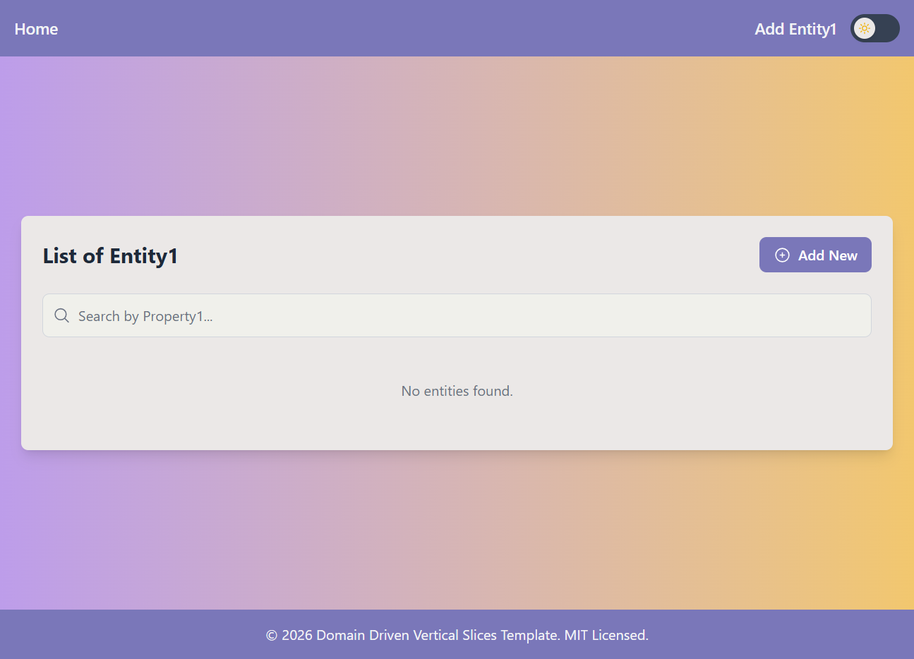
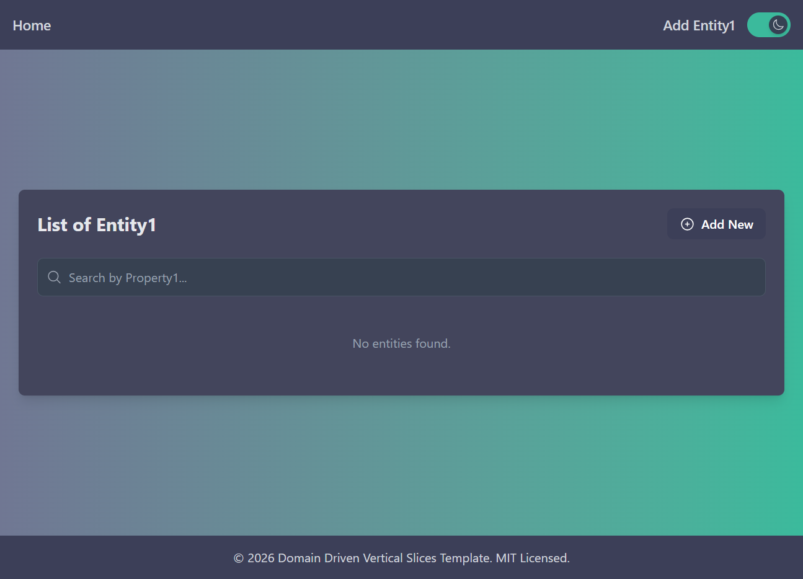

# Domain Driven Vertical Slices Template

[](https://github.com/RezaMashayekhi/DomainDrivenVerticalSlices.Template/actions/workflows/build.yml)
[](https://github.com/RezaMashayekhi/DomainDrivenVerticalSlices.Template/actions/workflows/codeql.yml)
[](https://www.nuget.org/packages/RM.DomainDrivenVerticalSlices.Template)
[](https://www.nuget.org/packages/RM.DomainDrivenVerticalSlices.Template)

An ASP.NET Core template implementing **Domain-Driven Design (DDD)** with **Vertical Slice Architecture**. Built for scalability, maintainability, and clean separation of concerns — with optional React UI, .NET Aspire orchestration, and comprehensive testing infrastructure.

## Like This Template? ⭐

If you find this template helpful, please [give it a star on GitHub](https://github.com/RezaMashayekhi/DomainDrivenVerticalSlices.Template)! Your support helps others discover this template.

---

## What's New in 10.7.0

### Security release — new projects build again

- **Fixed generated projects failing to build**: newly published security advisories against
  transitive packages (`MessagePack`, `Microsoft.OpenApi`, `SQLitePCLRaw.lib.e_sqlite3`) broke
  fresh `dotnet new` output via NuGet audit + `TreatWarningsAsErrors`. All three are now pinned
  to patched versions in **both** templates.
- **React UI dependency audit clean**: resolved all 9 `npm audit` findings (including a
  critical Vitest advisory) via a lockfile refresh.
- **Domain events fixed (Clean Architecture)**: events raised with `AddDomainEvent` are now
  actually dispatched — exactly once, after a successful save. Previously the interceptor
  dispatch was a silent no-op masked by a duplicate manual publish.
- **Safer logging defaults**: request/response payload properties are logged at `Debug` only,
  and slow-request/unhandled-exception logs no longer embed the full request object;
  `Information` keeps the request name, outcome, and error details.
- **Leaner, reproducible package**: repo/AI maintainer files, editor state, and build outputs
  no longer ship into the package or generated projects; the React project `.gitignore` ships
  again; the Swagger title now takes your project's name in both templates.

<details>
<summary><strong>What's New in 10.6.0</strong></summary>

### Modular Monolith Template

- **New `ddvs-modular` template**: LLM-friendly modular monolith with vertical slices organized by business capability.
- **Compatibility preserved**: `ddvs` keeps the existing Clean Architecture behavior, and `ddvs-clean` is now an explicit short name for that template style.
- **API-first modular release**: The first modular template uses Minimal APIs, SQLite, and optional Aspire support. React UI, controller support, and database-provider selection are deferred for future modular releases.
- **LLM-friendly by structure**: organized by business module and vertical slice so features stay local and easy for humans and AI agents to navigate. (Architecture ADRs and Copilot instructions live in the template repository as reference — generated projects are kept clean and do not receive them.)

</details>

## Available Templates

This package contains multiple templates.

### ddvs

Backward-compatible Clean Architecture template with separate WebApi, Application, Domain, Infrastructure, Common, AppHost, and ServiceDefaults projects.

```bash
dotnet new ddvs -n MyApplication
```

### ddvs-clean

Explicit Clean Architecture short name for the existing template behavior.

```bash
dotnet new ddvs-clean -n MyApplication
```

### ddvs-modular

LLM-friendly modular monolith with vertical slices organized by business module. The modular template (since `10.6.0`) is API-only Minimal API with SQLite and Aspire enabled by default.

```bash
dotnet new ddvs-modular -n MyApplication
```

To omit Aspire projects:

```bash
dotnet new ddvs-modular -n MyApplication --UseAspire false
```

<details>
<summary><strong>Security &amp; Dependencies in 10.5.0</strong></summary>

- **OpenTelemetry DoS fixes**: exporter/hosting upgraded to 1.15.3 (CVE-2026-40894, CVE-2026-40182, CVE-2026-40891); transitive `OpenTelemetry.Api` pinned to 1.15.3.
- **Front-end fixes**: Vite → 6.4.2 (CVE-2026-39363, CVE-2026-39365); PostCSS → 8.5.12 (GHSA-qx2v-qp2m-jg93).
- **Dependency upgrades**: EF Core → 10.0.7, Aspire → 13.2.4, and refreshed test tooling.
- **Deterministic builds**: enabled NuGet transitive pinning.

See the [CHANGELOG](https://github.com/RezaMashayekhi/DomainDrivenVerticalSlices.Template/blob/main/CHANGELOG.md) for full details.

</details>

## What's New in 10.4.0

### API Style Customization

- **Choose Your API Style**: Select between traditional MVC controllers (`--ApiType Controller`, default) or modern Minimal API endpoints (`--ApiType MinimalApi`) when creating a project
- **Clean Routes**: Both styles use consistent `/api/{Entity}` routes
- **Full Test Coverage**: Endpoint unit tests included for both API styles

### Security Fixes

- **minimatch**: Fixed ReDoS vulnerability (CVE-2026-27903) in React UI dependencies
- **Transitive Dependencies**: Updated ajv, flatted, and rollup to resolve additional vulnerabilities

## Recent Enhancements

<details>
<summary><strong>Key Features Introduced in 10.3.0</strong></summary>

#### .NET Aspire Integration

- **Aspire AppHost**: Orchestrate your entire application with a single command using .NET Aspire 13.1
- **Service Defaults**: Pre-configured OpenTelemetry, health checks, service discovery, and resilience patterns
- **React + Vite Support**: Automatic Vite dev server integration via `AddViteApp()` when using React UI
- **Dynamic Service Discovery**: Aspire injects service URLs automatically — no hardcoded ports needed

#### Domain & Infrastructure Enhancements

- **BaseEntity & BaseAuditableEntity**: Rich base classes with domain event support and automatic audit tracking (Created/Modified timestamps and user info)
- **EF Core Interceptors**: Auto-dispatch domain events and populate audit fields via `SaveChangesAsync` interceptors
- **IUser/CurrentUser**: Clean abstraction for accessing current user context across layers

#### Application Layer Improvements

- **Performance Behavior**: Logs warnings for slow-running requests (configurable threshold)
- **Unhandled Exception Behavior**: Centralized exception logging in the mediator pipeline

#### Testing Infrastructure

- **Testcontainers Support**: `TestcontainersWebApplicationFactory` for integration tests against real SQLite databases in Docker
- **MSW Integration**: Mock Service Worker for realistic API mocking in React tests

#### UI Improvements

- **Modern React UI**: Tailwind CSS v4, Headless UI, and Heroicons for a polished, accessible interface
- **Dark Mode Support**: Toggle between light and dark themes with localStorage persistence
- **Enhanced UX**: Modal confirmations for delete, cancel, and save operations

</details>

### Screenshots

> **Note**: Screenshots are best viewed on [GitHub](https://github.com/RezaMashayekhi/DomainDrivenVerticalSlices.Template). If viewing on NuGet.org, please visit the repository for the full visual experience.

|                   Light Mode                   |                  Dark Mode                   |
| :--------------------------------------------: | :------------------------------------------: |
|  |  |

## Getting Started

### Prerequisites

- [.NET 10.0 SDK](https://dotnet.microsoft.com/download/dotnet/10.0) (10.0.102 or later)
- [Node.js 20.19+ or 22.12+](https://nodejs.org/) (required only for React UI)
- [Docker](https://www.docker.com/) (optional, for Testcontainers integration tests)

### Installation

Install the template from NuGet:

```bash
dotnet new install RM.DomainDrivenVerticalSlices.Template@10.7.0
```

### Create a New Project

**Clean Architecture (backward-compatible `ddvs`):**

```bash
dotnet new ddvs -n MyApplication
```

**Clean Architecture (`ddvs-clean` explicit alias):**

```bash
dotnet new ddvs-clean -n MyApplication
```

**Modular Monolith (Aspire enabled by default):**

```bash
dotnet new ddvs-modular -n MyApplication
```

**Modular Monolith without Aspire:**

```bash
dotnet new ddvs-modular -n MyApplication --UseAspire false
```

**WebAPI Only (Controller API — default):**

```bash
dotnet new ddvs -n YourProjectName
```

**WebAPI with Minimal API endpoints:**

```bash
dotnet new ddvs -n YourProjectName --ApiType MinimalApi
```

**WebAPI with React UI:**

```bash
dotnet new ddvs -n YourProjectName --UiType React
```

**Combine options:**

```bash
dotnet new ddvs -n YourProjectName --ApiType MinimalApi --UiType React
```

## Running the Application

> The sections below describe the **Clean Architecture** output (`ddvs` / `ddvs-clean`).
> For the modular monolith (`ddvs-modular`) see
> [Modular Monolith layout](#modular-monolith-layout-ddvs-modular) — its API lives in
> `src/YourProjectName.Api` and its tests in `tests/` (not `test/`).

### Option 1: Using .NET Aspire (Recommended)

The template includes a pre-configured Aspire AppHost for orchestrating all services:

```bash
cd src/YourProjectName.AppHost
dotnet run
```

This starts the Aspire dashboard where you can monitor and access:

- **WebAPI**: Your backend API with health checks and OpenTelemetry
- **React UI** (if included): Vite dev server automatically integrated

### Option 2: Running Services Individually

**Start the WebAPI:**

```bash
cd src/YourProjectName.WebApi
dotnet run
```

**Start the React UI (if included):**

```bash
cd src/YourProjectName.UI.React
npm install
npm run dev
```

## Template Structure

```
YourProjectName/
├── src/
│   ├── YourProjectName.AppHost/          # .NET Aspire orchestration host
│   ├── YourProjectName.ServiceDefaults/  # Shared Aspire service configuration
│   ├── YourProjectName.WebApi/           # ASP.NET Core Web API
│   ├── YourProjectName.Application/      # Business logic, commands, queries
│   ├── YourProjectName.Domain/           # Entities, value objects, domain events
│   ├── YourProjectName.Infrastructure/   # Data access, repositories, EF Core
│   ├── YourProjectName.Common/           # Shared utilities, Result pattern, Mediator
│   └── YourProjectName.UI.React/         # React frontend (if included)
└── test/
    ├── YourProjectName.IntegrationTests/ # Integration tests with Testcontainers
    ├── YourProjectName.Application.Tests/
    ├── YourProjectName.Domain.Tests/
    ├── YourProjectName.Infrastructure.Tests/
    ├── YourProjectName.WebApi.Tests/
    └── YourProjectName.Common.Tests/
```

### Project Descriptions

| Project             | Description                                                                            |
| ------------------- | -------------------------------------------------------------------------------------- |
| **AppHost**         | .NET Aspire orchestration — starts and monitors all services from a single entry point |
| **ServiceDefaults** | OpenTelemetry, health checks, service discovery, and HTTP resilience configuration     |
| **WebApi**          | REST API with controllers or minimal API endpoints (configurable via `--ApiType`)      |
| **Application**     | Commands, queries, DTOs, validators, and pipeline behaviors                            |
| **Domain**          | Entities (with `BaseEntity`/`BaseAuditableEntity`), value objects, and domain events   |
| **Infrastructure**  | EF Core `DbContext`, repositories, migrations, and interceptors                        |
| **Common**          | Custom mediator, Result pattern, Error types, and ValueObject base class               |
| **UI.React**        | React 19 + Vite 6 + Tailwind CSS v4 frontend with dark mode support                    |

### Modular Monolith layout (ddvs-modular)

The `ddvs-modular` template generates a different, single-project layout organized by
business module and vertical slice:

```
YourProjectName/
├── src/
│   ├── YourProjectName.Api/                  # Single Minimal API project
│   │   ├── Common/{Endpoints,Errors,Persistence}
│   │   └── Modules/Entity1/{Contracts,Domain,Endpoints,Features,Infrastructure}
│   ├── YourProjectName.AppHost/              # only with --UseAspire true (default)
│   └── YourProjectName.ServiceDefaults/      # only with --UseAspire true (default)
└── tests/                                    # note: 'tests', not 'test'
    ├── YourProjectName.UnitTests/
    ├── YourProjectName.IntegrationTests/
    └── YourProjectName.ArchitectureTests/
```

Run it with `dotnet run --project src/YourProjectName.AppHost` (Aspire) or
`dotnet run --project src/YourProjectName.Api` (API only / `--UseAspire false`). Each
feature follows an explicit **Endpoint → Validator → Handler → DbContext/Domain** flow —
no mediator, generic repositories, or Unit of Work. See the generated project's `README.md`
and the `Modules/Entity1/README.md` for details.

## Key Features

### Architecture

- **Vertical Slice Architecture**: Features organized by business capability, not technical layers
- **Domain-Driven Design**: Rich domain model with entities, value objects, and domain events
- **CQRS Pattern**: Commands and queries separated via custom lightweight mediator
- **Result Pattern**: No exceptions for business logic — explicit success/failure handling

### .NET Aspire Integration

- **Orchestrated Startup**: Single command launches entire application stack
- **OpenTelemetry**: Distributed tracing, metrics, and logging out of the box
- **Health Checks**: Built-in `/health` and `/alive` endpoints
- **Service Discovery**: Services find each other automatically
- **HTTP Resilience**: Retry policies and circuit breakers pre-configured

### Testing

- **Unit Tests**: xUnit + Moq for isolated testing
- **Integration Tests**: Two options included:
    - `CustomWebApplicationFactory` — In-memory SQLite database
    - `TestcontainersWebApplicationFactory` — Real SQLite in Docker container
- **React Tests**: Vitest + MSW for component and API mocking tests

### Domain Infrastructure

- **BaseEntity**: Domain event collection and identity
- **BaseAuditableEntity**: Automatic `CreatedAt`, `CreatedBy`, `ModifiedAt`, `ModifiedBy`
- **EF Core Interceptors**: Auto-populate audit fields and dispatch domain events after a successful save
- **IUser Abstraction**: Clean access to current user context

### Pipeline Behaviors

- **ValidationBehaviour**: FluentValidation integration — validates before handler execution
- **LoggingBehaviour**: Logs request name and outcome at `Information`; payload properties at `Debug` only (sensitive property names skipped)
- **PerformanceBehaviour**: Warns when requests exceed threshold (default: 500ms)
- **UnhandledExceptionBehaviour**: Centralized exception logging

## Project Documentation

These maintainer docs live in the GitHub repository only — they are intentionally **not**
shipped in the NuGet package or into generated projects:

- [CHANGELOG.md](https://github.com/RezaMashayekhi/DomainDrivenVerticalSlices.Template/blob/main/CHANGELOG.md) — notable changes per version (Keep a Changelog format).
- [docs/ROADMAP.md](https://github.com/RezaMashayekhi/DomainDrivenVerticalSlices.Template/blob/main/docs/ROADMAP.md) — planned direction (candidates, not promises).
- [docs/RELEASE_PROCESS.md](https://github.com/RezaMashayekhi/DomainDrivenVerticalSlices.Template/blob/main/docs/RELEASE_PROCESS.md) — validation, packaging, and release steps.
- [CLAUDE.md](https://github.com/RezaMashayekhi/DomainDrivenVerticalSlices.Template/blob/main/CLAUDE.md) — guidance for Claude Code and other AI agents working in this repository.

## License

Distributed under the MIT License. See [LICENSE](https://github.com/RezaMashayekhi/DomainDrivenVerticalSlices.Template/blob/main/LICENSE) for more information.

## Development Notes

This template supports optional configurations for the API style and React frontend. For developers who are **modifying the template** or testing features specific to a configuration, it is crucial to set the environment variables accordingly:

### Setting the Environment Variables

**For Windows:**

```bash
set UiType=React       # Use 'None' for WebAPI only setups (default)
set ApiType=MinimalApi  # Use 'Controller' for traditional MVC controllers (default)
```

**Setting Permanent Environment Variables (Windows):**

```bash
setx UiType React         # Sets 'UiType' permanently for the current user
setx ApiType MinimalApi    # Sets 'ApiType' permanently for the current user
```

> **Note:** `setx` changes will only affect new command prompt sessions, not the current session.

**For Linux/macOS:**

```bash
export UiType=React       # Use 'None' for WebAPI only setups (default)
export ApiType=MinimalApi  # Use 'Controller' for traditional MVC controllers (default)
```

These settings enable the appropriate API style and CORS configurations necessary for communication between the React frontend and the backend during development.

> **Important:** These environment variables are specifically for development and testing within the template's context. Users creating new projects from this template do not need to set them — the template engine handles it automatically based on the `--ApiType` and `--UiType` parameters.

### Running Tests

```bash
# Run all tests
dotnet test

# Run with coverage
dotnet test --collect:"XPlat Code Coverage"
```

## Contributing

We welcome contributions! Here's how you can help:

1. **Fork & Clone**: Fork the repository and clone locally
2. **Branch**: Create a feature branch (`git checkout -b feature/amazing-feature`)
3. **Commit**: Make your changes with clear commit messages
4. **Test**: Ensure all tests pass (`dotnet test`)
5. **PR**: Submit a pull request

### Guidelines

- Follow the existing code style and patterns
- Add tests for new functionality
- Update documentation as needed
- Use [conventional commits](https://www.conventionalcommits.org/) for commit messages

**Bug Reports & Feature Requests**: Use [GitHub Issues](https://github.com/RezaMashayekhi/DomainDrivenVerticalSlices.Template/issues)
